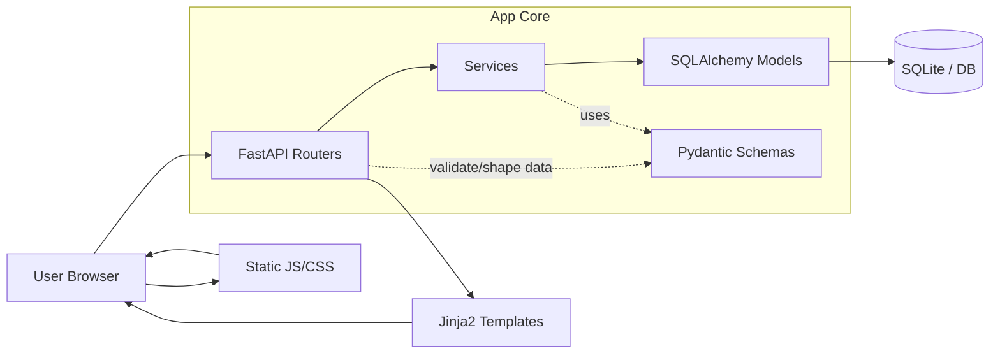

# SenseWord

A multisensory English-vocabulary learning MVP built with FastAPI.

## Quick start

**Important:** run commands from the `senseword/` directory (the folder that
contains `app/` and `requirements.txt`). If you run `uvicorn` from the parent
folder or from inside `app/`, you will get `ModuleNotFoundError: No module named 'app'`.

```bash
cd senseword

# create venv (Python 3.10+)
python3 -m venv .venv
source .venv/bin/activate

pip install -r requirements.txt

# start the server (from senseword/ — required so Python finds the app package)
uvicorn app.main:app --host 0.0.0.0 --port 8000
```

Then open http://127.0.0.1:8000 (or http://localhost:8000).

Development with auto-reload:

```bash
uvicorn app.main:app --host 0.0.0.0 --port 8000 --reload
```

Shortcut (same as above, reload enabled):

```bash
python run.py
```

> **Note:** You must run `uvicorn` from the `senseword/` folder (the one that
> contains `app/` and `requirements.txt`). From the parent folder or from
> inside `app/` you will get `ModuleNotFoundError: No module named 'app'`.

## Curated vocabulary study flow (`/study`)

Preloaded exam vocabulary (TOEFL / IELTS / SAT / GRE / academic) lives in the
**catalog** (`catalog_words` table), separate from words a user adds manually.

On first startup the app seeds the catalog. It prefers the full generated
dataset `app/data/vocabulary_full.json` (**10,000 words**) and falls back to
the small `app/data/vocabulary_seed.json` (20 words) if the full file is
missing. The study screen reveals content step by step:

1. English word → 2. Turkish meaning → 3. Pronunciation + audio → 4. Image →
5. Example sentence → 6. User sentence → 7. Voice recording → 8. Save

**Browse by level** (`/study`): words are split into **beginner /
intermediate / advanced** tabs (2000 / 3000 / 5000 words). Choose how many to
show at once — **100 / 500 / 1000 per page** — paginate, or jump straight to
any word.

**On the study card** (`/study/card/{n}`): step navigation **±1** plus
multi-step jumps **±10 / ±100**, a **Go to word #** box, and a progress bar
(`Word 1234 of 10000`). Navigation stays within the selected level.

### The 10,000-word dataset

The shipped dataset is built from free / open sources and committed as
`app/data/vocabulary_full.json`:

| Field | Source |
|---|---|
| English word (frequency-ranked) | google-10000-english |
| Turkish translation | FreeDict `eng-tur` |
| IPA pronunciation | open-dict-data `ipa-dict` (en_US) |
| Example sentence (EN + TR) | OPUS **Tatoeba** aligned pairs |
| Audio | browser text-to-speech (word **and** sentence) — no audio files needed |
| Image | keyword image service (`loremflickr`) — works for every word |
| Level / exam category | derived from frequency rank |

**Regenerate the dataset** (e.g. to change size or sources):

```bash
cd senseword
python scripts/download_sources.py    # one-time: fetch raw sources into data/
python scripts/generate_dataset.py    # build app/data/vocabulary_full.json
rm -f senseword.db                     # so the catalog re-seeds on next start
python run.py
```

> Audio: every word and example sentence is spoken via the browser's Web
> Speech API, so all 10,000 entries have working pronunciation without
> shipping any audio files. To use real recorded audio later, set each word's
> `audio_url` and the player will use it automatically (falling back to TTS).

### Import your own dataset

Prepare a JSON array or CSV with the same fields, then:

```bash
python scripts/import_vocabulary.py path/to/vocabulary.json
```

Existing words (matched by `word`) are skipped, so imports are safe to re-run.
CSV `exam_category` column: use pipe-separated values, e.g. `TOEFL|IELTS|SAT`.

---

## High-Level Architecture Summary

SenseWord follows a layered monolith structure:

1. **Presentation layer** (`app/routers/`, `app/templates/`, `app/static/`)
   Handles HTTP requests, renders HTML pages, and provides browser-side behavior (CSS/JS, speech helpers).
2. **Application/Domain layer** (`app/services/`)
   Encapsulates business logic: authentication, vocabulary lifecycle, spaced repetition scheduling, and speech-related abstraction.
3. **Data contract layer** (`app/schemas/`)
   Defines validated input/output shapes between routes/services and future API clients.
4. **Persistence layer** (`app/models/`, `app/database.py`)
   SQLAlchemy models, DB engine/session setup, and table lifecycle initialization.
5. **Composition root** (`app/main.py`)
   Wires startup lifecycle, static assets, and route registration.



## Directory-to-Responsibility Map

- `app/routers/`: Endpoint handlers per feature (`auth`, `dashboard`, `vocabulary`, `learning`, `review`, `study`, `api`).
- `app/services/`: Reusable business logic and rules (`catalog_service`, `seed_service`, …).
- `app/models/`: ORM entities (`User`, `Vocabulary`, `CatalogWord`, `UserWordAnswer`, …).
- `app/schemas/`: Validation and DTO models.
- `app/templates/`: Server-rendered UI pages.
- `app/static/`: CSS and client-side JS behavior.
- `app/database.py`: DB connection/session/base/init.
- `app/main.py`: App bootstrap and router mounting.
- `app/__pycache__/` (and others): Runtime bytecode cache (non-architectural).
